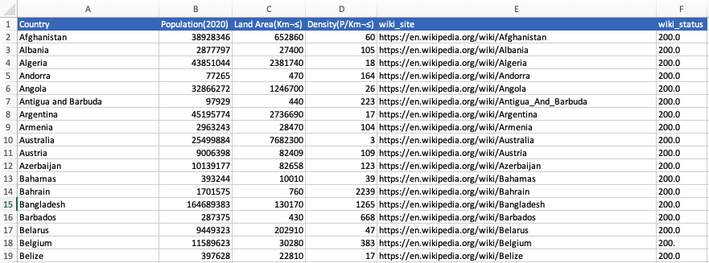

# Introduction

Goal of this program is to test Webscrapping functionalities using BeautifulSoup.
We start by retrieving the list of country name from site https://www.worldometers.info


# Usage

- ```01_get_countries.py``` is retreiving the list of country names from site https://www.worldometers.info, generate from this expected url for wiki site and save result in countries.csv
- ```02_get_wiki_details.py``` is going to each wiki site, retrieve some information  from the right frame, generate a dataframe with this & save result to file countries_details.csv
>**Note**: *Development is ongoing. Other inforamtion nneds to be retrieved.*

# Sample

## countries.csv


## countries_details.csv


# Release Notes

See the [RELEASE_NOTES](RELEASE_NOTES.md) file for more details.

# License

See the [LICENSE](LICENSE.md) file for license rights and limitations (MIT).
